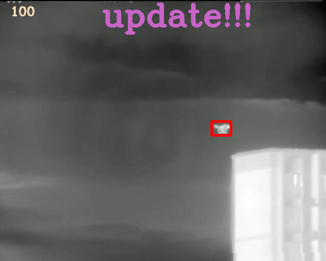
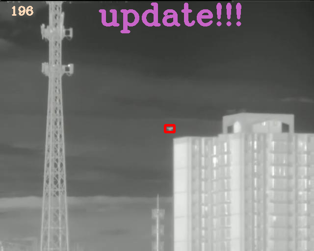
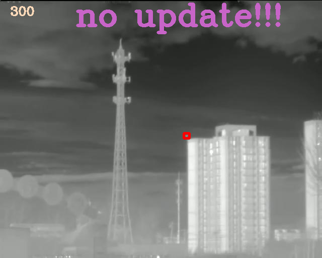

# This is the official implementation of SiamDT


## Installation
**Step 1.** Create a conda environment and activate it.

```shell
conda create -n SiamDT python=3.7
conda activate SiamDT
```

**Step 2.** Install torch, torchvision.
```shell
pip install torch===1.8.1+cu111 -f https://download.pytorch.org/whl/torch_stable.html
pip install torchvision===0.9.1+cu111 -f https://download.pytorch.org/whl/torch_stable.html
```
Other versions of python, cuda and torch are also compatible. Please refer to the installation requirements for [SwinTransformer](https://github.com/SwinTransformer/Swin-Transformer-Object-Detection).

**Step 3.** Install mmcv-full.
```shell
pip install -U openmim
mim install mmcv-full==1.3.0 -f https://download.openmmlab.com/mmcv/dist/cu111/torch1.8.1/index.html
```

**Step 4.** Install other requirements.
```shell
pip install matplotlib opencv-python shapely visdom
```

**Step 5.** Build Swin Transformer Object Detection.
```shell
cd libs/swintransformer/
pip install -r requirements/build.txt
python setup.py develop
```

**Step 6.** Prepare pre-trained models.

Download the pre-trained model at the [Swin Transformer project](https://github.com/SwinTransformer/Swin-Transformer-Object-Detection), this tutorial uses Cascade Mask R-CNN framework and Swin-T backbone as an example.

1) Download 'cascade_mask_rcnn_swin_tiny_patch4_window7.pth' at this [link](https://github.com/SwinTransformer/Swin-Transformer-Object-Detection)

2) Run 'utils/obtain_pretrained_weights.py' to get the weights for backbone and neck only, and save it as a tar file for compatibility with lower versions of torch.

3) Place the 'cascade_mask_rcnn_swin_tiny.pth.tar' generated in step 2) under the 'SiamDT/pretrained_weights/' folder path.

Note: Or you can directly download the processed pre-trained weights from the following links: ([Google drive](https://drive.google.com/file/d/160tU2B5VproDAQSz6lYw-7jrNC3BsAHj/view?usp=sharing) and [Baidu disk](https://pan.baidu.com/s/1X0WZbXY271nOEfstvW2Azg?pwd=a410) Access code: a410)

**Step 7.** Train SiamDT.

Change the dataset path in 'datasets/wrappers.py' and run:
```shell
python tracking_train_demo.py
```

**Step 8.** Test SiamDT.

Download the demo checkpoints from the following links: ([Google drive](https://drive.google.com/file/d/1ovjDnsB5FDGIY0D1smqW9U08J4ROMjW2/view?usp=sharing) and [Baidu disk](https://pan.baidu.com/s/1pUO2xSCuEZ2vaGDzuMeLnQ?pwd=a410) Access code: a410)

Change the dataset path in 'tracking_test_demo.py' and run:
```shell
python tracking_test_demo.py
```





Note: If you want to visualise the tracking results, please use the following command first:
```shell
python -m visdom.server -port=5123
```
Then you can see the visualisation on the [http://localhost:5123/](http://localhost:5123/).
